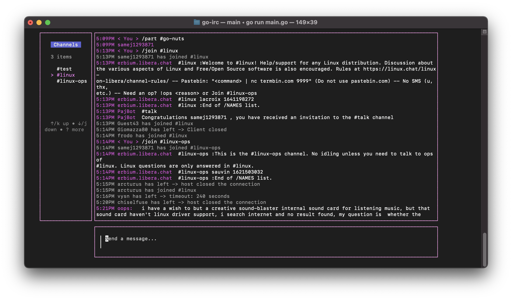

# Gopher Chat


This is an IRC client written in Go, using [Bubble Tea](https://github.com/charmbracelet/bubbletea) for a built out TUI experience.

The mission is to be the user-friendliest IRC tui on the market.



### Current Features
* The usual IRC Commands (join, quit, nick, privmsg, etc.)
* Send/Receive messages

### Roadmap
In order of priority:
* Toggle view between active channels
* User configuration page
* Support auto-completion for commands

### How to Run:

This software is tested on `go1.18.1`

```
git clone https://github.com/jamesthesken/go-irc.git
cd go-irc
go build
./gopherchatv2
```

### There are a lot of bugs!
This code needs work, so expect some instability.

